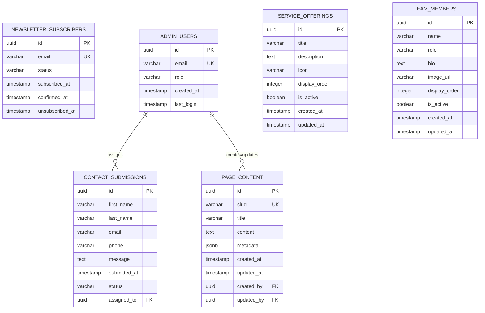

# Data Model Specification

**Feature**: TheFavrs Website Recreation
**Date**: 2025-01-14
**Branch**: 001-i-want-to

## Entity Relationship Diagram



## Entity Definitions

### 1. Newsletter Subscribers
**Purpose**: Store email addresses for marketing communications
**Table**: `newsletter_subscribers`

| Field | Type | Constraints | Description |
|-------|------|------------|-------------|
| id | UUID | PRIMARY KEY, DEFAULT gen_random_uuid() | Unique identifier |
| email | VARCHAR(255) | UNIQUE, NOT NULL | Subscriber email address |
| status | VARCHAR(50) | DEFAULT 'pending' | pending, confirmed, unsubscribed |
| subscribed_at | TIMESTAMP | DEFAULT NOW() | Initial subscription time |
| confirmed_at | TIMESTAMP | NULL | Double opt-in confirmation |
| unsubscribed_at | TIMESTAMP | NULL | Unsubscribe timestamp |

**Indexes**:
- PRIMARY KEY on `id`
- UNIQUE on `email`
- INDEX on `status` for filtering active subscribers

**Validation Rules**:
- Email must be valid format (RFC 5322)
- Status must be one of: pending, confirmed, unsubscribed
- Cannot re-subscribe if unsubscribed within 30 days

### 2. Contact Submissions
**Purpose**: Store consultation form submissions
**Table**: `contact_submissions`

| Field | Type | Constraints | Description |
|-------|------|------------|-------------|
| id | UUID | PRIMARY KEY, DEFAULT gen_random_uuid() | Unique identifier |
| first_name | VARCHAR(100) | NOT NULL | Contact first name |
| last_name | VARCHAR(100) | NOT NULL | Contact last name |
| email | VARCHAR(255) | NOT NULL | Contact email |
| phone | VARCHAR(20) | NOT NULL | Contact phone |
| message | TEXT | NULL | Optional message |
| submitted_at | TIMESTAMP | DEFAULT NOW() | Submission timestamp |
| status | VARCHAR(50) | DEFAULT 'new' | new, contacted, qualified, closed |
| assigned_to | UUID | NULL, FK to admin_users | Assigned admin |

**Indexes**:
- PRIMARY KEY on `id`
- INDEX on `status` for filtering
- INDEX on `submitted_at` for sorting
- INDEX on `email` for duplicate checking

**Validation Rules**:
- First and last name: 2-100 characters, letters/spaces/hyphens only
- Email must be valid format
- Phone must be valid format (E.164 or US format)
- Message: max 5000 characters

### 3. Admin Users
**Purpose**: Store admin accounts for content management
**Table**: `admin_users`

| Field | Type | Constraints | Description |
|-------|------|------------|-------------|
| id | UUID | PRIMARY KEY, DEFAULT gen_random_uuid() | Unique identifier |
| email | VARCHAR(255) | UNIQUE, NOT NULL | Admin email |
| role | VARCHAR(50) | DEFAULT 'editor' | admin, editor, viewer |
| created_at | TIMESTAMP | DEFAULT NOW() | Account creation |
| last_login | TIMESTAMP | NULL | Last login timestamp |

**Note**: Authentication handled by Supabase Auth, this table for app-specific data

### 4. Page Content
**Purpose**: CMS storage for dynamic page content
**Table**: `page_content`

| Field | Type | Constraints | Description |
|-------|------|------------|-------------|
| id | UUID | PRIMARY KEY, DEFAULT gen_random_uuid() | Unique identifier |
| slug | VARCHAR(255) | UNIQUE, NOT NULL | URL slug |
| title | VARCHAR(255) | NOT NULL | Page title |
| content | TEXT | NOT NULL | Page content (markdown) |
| metadata | JSONB | DEFAULT '{}' | SEO and page metadata |
| created_at | TIMESTAMP | DEFAULT NOW() | Creation timestamp |
| updated_at | TIMESTAMP | DEFAULT NOW() | Last update |
| created_by | UUID | FK to admin_users | Creator |
| updated_by | UUID | FK to admin_users | Last editor |

**Indexes**:
- PRIMARY KEY on `id`
- UNIQUE on `slug`
- INDEX on `updated_at` for cache invalidation

### 5. Service Offerings
**Purpose**: Dynamic service descriptions
**Table**: `service_offerings`

| Field | Type | Constraints | Description |
|-------|------|------------|-------------|
| id | UUID | PRIMARY KEY, DEFAULT gen_random_uuid() | Unique identifier |
| title | VARCHAR(255) | NOT NULL | Service title |
| description | TEXT | NOT NULL | Service description |
| icon | VARCHAR(100) | NULL | Icon identifier |
| display_order | INTEGER | NOT NULL | Display sequence |
| is_active | BOOLEAN | DEFAULT true | Visibility flag |
| created_at | TIMESTAMP | DEFAULT NOW() | Creation timestamp |
| updated_at | TIMESTAMP | DEFAULT NOW() | Last update |

**Indexes**:
- PRIMARY KEY on `id`
- INDEX on `display_order` for sorting
- INDEX on `is_active` for filtering

### 6. Team Members
**Purpose**: Founder/team profile storage
**Table**: `team_members`

| Field | Type | Constraints | Description |
|-------|------|------------|-------------|
| id | UUID | PRIMARY KEY, DEFAULT gen_random_uuid() | Unique identifier |
| name | VARCHAR(255) | NOT NULL | Member name |
| role | VARCHAR(100) | NOT NULL | Position/title |
| bio | TEXT | NOT NULL | Biography |
| image_url | VARCHAR(500) | NULL | Profile image |
| display_order | INTEGER | NOT NULL | Display sequence |
| is_active | BOOLEAN | DEFAULT true | Visibility flag |
| created_at | TIMESTAMP | DEFAULT NOW() | Creation timestamp |
| updated_at | TIMESTAMP | DEFAULT NOW() | Last update |

## State Transitions

### Newsletter Subscriber States
```
pending → confirmed (via email confirmation)
confirmed → unsubscribed (user action)
unsubscribed → pending (re-subscription after 30 days)
```

### Contact Submission States
```
new → contacted (admin reaches out)
contacted → qualified (potential client)
contacted → closed (not qualified)
qualified → closed (deal done or lost)
```

## Row Level Security (RLS) Policies

### Newsletter Subscribers
- **INSERT**: Anyone can insert (public signup)
- **SELECT**: Only admins can select
- **UPDATE**: Only admins can update
- **DELETE**: Only admins can delete

### Contact Submissions
- **INSERT**: Anyone can insert (public form)
- **SELECT**: Only admins can select
- **UPDATE**: Only admins can update
- **DELETE**: Disabled (audit trail)

### Admin Users
- **ALL**: Only super admins via Supabase dashboard

### Page Content
- **SELECT**: Public for published content
- **INSERT/UPDATE/DELETE**: Only authenticated admins

### Service Offerings
- **SELECT**: Public for active offerings
- **INSERT/UPDATE/DELETE**: Only authenticated admins

### Team Members
- **SELECT**: Public for active members
- **INSERT/UPDATE/DELETE**: Only authenticated admins

## Migration Scripts

### Initial Schema (V1.0.0)
```sql
-- Enable UUID extension
CREATE EXTENSION IF NOT EXISTS "uuid-ossp";

-- Newsletter Subscribers
CREATE TABLE newsletter_subscribers (
    id UUID PRIMARY KEY DEFAULT gen_random_uuid(),
    email VARCHAR(255) UNIQUE NOT NULL,
    status VARCHAR(50) DEFAULT 'pending' CHECK (status IN ('pending', 'confirmed', 'unsubscribed')),
    subscribed_at TIMESTAMP WITH TIME ZONE DEFAULT NOW(),
    confirmed_at TIMESTAMP WITH TIME ZONE,
    unsubscribed_at TIMESTAMP WITH TIME ZONE
);

CREATE INDEX idx_newsletter_status ON newsletter_subscribers(status);

-- Contact Submissions
CREATE TABLE contact_submissions (
    id UUID PRIMARY KEY DEFAULT gen_random_uuid(),
    first_name VARCHAR(100) NOT NULL,
    last_name VARCHAR(100) NOT NULL,
    email VARCHAR(255) NOT NULL,
    phone VARCHAR(20) NOT NULL,
    message TEXT,
    submitted_at TIMESTAMP WITH TIME ZONE DEFAULT NOW(),
    status VARCHAR(50) DEFAULT 'new' CHECK (status IN ('new', 'contacted', 'qualified', 'closed')),
    assigned_to UUID REFERENCES admin_users(id)
);

CREATE INDEX idx_contact_status ON contact_submissions(status);
CREATE INDEX idx_contact_submitted ON contact_submissions(submitted_at DESC);
CREATE INDEX idx_contact_email ON contact_submissions(email);

-- Admin Users
CREATE TABLE admin_users (
    id UUID PRIMARY KEY DEFAULT gen_random_uuid(),
    email VARCHAR(255) UNIQUE NOT NULL,
    role VARCHAR(50) DEFAULT 'editor' CHECK (role IN ('admin', 'editor', 'viewer')),
    created_at TIMESTAMP WITH TIME ZONE DEFAULT NOW(),
    last_login TIMESTAMP WITH TIME ZONE
);

-- Page Content
CREATE TABLE page_content (
    id UUID PRIMARY KEY DEFAULT gen_random_uuid(),
    slug VARCHAR(255) UNIQUE NOT NULL,
    title VARCHAR(255) NOT NULL,
    content TEXT NOT NULL,
    metadata JSONB DEFAULT '{}',
    created_at TIMESTAMP WITH TIME ZONE DEFAULT NOW(),
    updated_at TIMESTAMP WITH TIME ZONE DEFAULT NOW(),
    created_by UUID REFERENCES admin_users(id),
    updated_by UUID REFERENCES admin_users(id)
);

CREATE INDEX idx_page_updated ON page_content(updated_at DESC);

-- Service Offerings
CREATE TABLE service_offerings (
    id UUID PRIMARY KEY DEFAULT gen_random_uuid(),
    title VARCHAR(255) NOT NULL,
    description TEXT NOT NULL,
    icon VARCHAR(100),
    display_order INTEGER NOT NULL,
    is_active BOOLEAN DEFAULT true,
    created_at TIMESTAMP WITH TIME ZONE DEFAULT NOW(),
    updated_at TIMESTAMP WITH TIME ZONE DEFAULT NOW()
);

CREATE INDEX idx_service_order ON service_offerings(display_order);
CREATE INDEX idx_service_active ON service_offerings(is_active);

-- Team Members
CREATE TABLE team_members (
    id UUID PRIMARY KEY DEFAULT gen_random_uuid(),
    name VARCHAR(255) NOT NULL,
    role VARCHAR(100) NOT NULL,
    bio TEXT NOT NULL,
    image_url VARCHAR(500),
    display_order INTEGER NOT NULL,
    is_active BOOLEAN DEFAULT true,
    created_at TIMESTAMP WITH TIME ZONE DEFAULT NOW(),
    updated_at TIMESTAMP WITH TIME ZONE DEFAULT NOW()
);

CREATE INDEX idx_team_order ON team_members(display_order);
CREATE INDEX idx_team_active ON team_members(is_active);

-- Updated at trigger function
CREATE OR REPLACE FUNCTION update_updated_at()
RETURNS TRIGGER AS $$
BEGIN
    NEW.updated_at = NOW();
    RETURN NEW;
END;
$$ LANGUAGE plpgsql;

-- Apply updated_at triggers
CREATE TRIGGER update_page_content_updated_at BEFORE UPDATE ON page_content
    FOR EACH ROW EXECUTE FUNCTION update_updated_at();

CREATE TRIGGER update_service_offerings_updated_at BEFORE UPDATE ON service_offerings
    FOR EACH ROW EXECUTE FUNCTION update_updated_at();

CREATE TRIGGER update_team_members_updated_at BEFORE UPDATE ON team_members
    FOR EACH ROW EXECUTE FUNCTION update_updated_at();
```

## Seed Data

```sql
-- Initial team members
INSERT INTO team_members (name, role, bio, display_order, is_active) VALUES
('Will Bridges', 'Co-Founder', 'Engineering leader and entrepreneur with over 25 years of experience...', 1, true),
('Joe Major', 'Co-Founder', 'Chicago-born, Nashville-based host, promoter, and radio personality...', 2, true);

-- Initial service offerings
INSERT INTO service_offerings (title, description, icon, display_order, is_active) VALUES
('Custom Branded Events For Venues', 'We create unforgettable branded experiences...', 'calendar', 1, true),
('Software That Helps You Reach Your Customers', 'Custom software solutions designed...', 'code', 2, true),
('Build You a Beautiful & Professional Website', 'Modern, responsive websites...', 'globe', 3, true),
('We Help You Make More Sales', 'Strategic sales and marketing...', 'trending-up', 4, true);

-- Initial page content
INSERT INTO page_content (slug, title, content, metadata) VALUES
('privacy-policy', 'Privacy Policy', '[Full privacy policy text from current site]', '{"description": "TheFavrs privacy policy"}'),
('terms-conditions', 'Terms & Conditions', '[Full terms text from current site]', '{"description": "TheFavrs terms and conditions"}');
```

## Data Access Patterns

### Common Queries

1. **Get active newsletter subscribers**
```sql
SELECT email FROM newsletter_subscribers
WHERE status = 'confirmed'
ORDER BY subscribed_at DESC;
```

2. **Recent contact submissions**
```sql
SELECT * FROM contact_submissions
WHERE status = 'new'
ORDER BY submitted_at DESC
LIMIT 10;
```

3. **Active services for homepage**
```sql
SELECT * FROM service_offerings
WHERE is_active = true
ORDER BY display_order;
```

4. **Team members for about section**
```sql
SELECT * FROM team_members
WHERE is_active = true
ORDER BY display_order;
```

## Performance Considerations

1. **Indexes**: All foreign keys and commonly filtered columns indexed
2. **Pagination**: Use cursor-based pagination for large result sets
3. **Caching**: Cache page_content, service_offerings, team_members (low write frequency)
4. **Connection Pooling**: Use Supabase connection pooler for serverless
5. **Query Optimization**: Use database views for complex joins

## Backup & Recovery

1. **Supabase Backups**: Daily automatic backups (retained 30 days)
2. **Point-in-time Recovery**: Available on Pro plan
3. **Export Strategy**: Weekly exports to S3 for long-term storage
4. **Test Restores**: Monthly restore tests to staging

---

This data model provides a solid foundation for the initial website requirements while supporting future CMS capabilities and expansion.